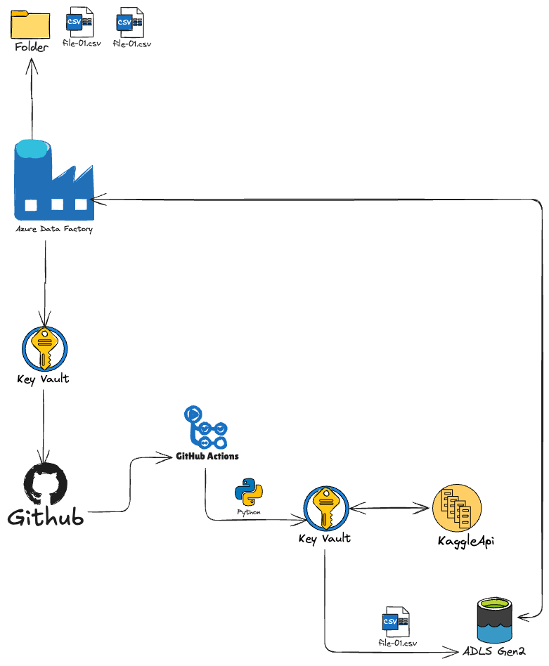
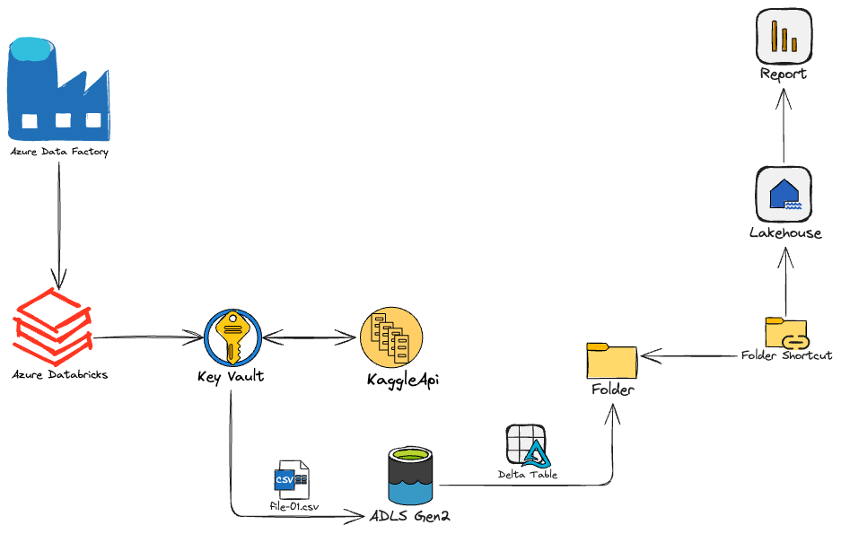

# data-ingester

Repositorio para la ingestión automatizada de datasets obtenidos mediante un API hacia Azure Data Lake Storage Gen2, utilizando scripts en Python ejecutados a través de GitHub Actions. Incluyendo la automatización vía Azure Function y notebooks de Databricks para transformación.

## Descripción

Este proyecto permite descargar datasets de Kaggle, procesarlos (incluyendo conversión a CSV cuando es necesario) y cargarlos automáticamente en contenedores de Azure Data Lake Storage (ADLS Gen2). La autenticación y parámetros se gestionan de manera segura mediante Azure Key Vault y Managed Identity.

Incluye:
- **Notebooks** para ingestión, montaje de almacenamiento y análisis exploratorio en Databricks.
- **Script Python y Azure Function** para automatizar la descarga, procesamiento y subida de archivos a ADLS.
- **Ejemplo de integración con Azure Data Factory**.

## Estructura del repositorio

- `FunctionApp/`: Azure Function para ingestión desde Kaggle a ADLS.
- `kaggle-ingester/`: Script Python CLI para ingestión programática.
- `Notebooks/`: Notebooks para Databricks (incluye ejemplos de uso y configuración).
- `AzureDataFactory/`: Pipeline de Azure Data Factory.

## Instalación

1. Clona el repositorio:
   ```bash
   git clone https://github.com/gquintal/data-ingester.git
   cd data-ingester
   ```

2. Instala los requisitos en tu entorno:
   ```bash
   pip install -r requirements.txt
   # O instala manualmente: kaggle, azure-identity, azure-storage-blob, azure-keyvault-secrets, pandas, etc.
   ```

3. Configura las variables de entorno requeridas:
   - `KEY_VAULT_URI`
   - `KAGGLE_DATASET`
   - `DATALAKE_URI`
   - `CONTAINER_NAME`

## Uso rápido

### Usar Azure Function (endpoint HTTP)
1. Despliega la función incluida en `FunctionApp/` en tu Azure Subscription.
2. Realiza una petición HTTP al endpoint `/api/kaggleingest` con las variables de entorno configuradas.
3. El dataset será descargado, procesado y subido al contenedor ADLS configurado.

### Usar notebook en Databricks
1. Abre `Notebooks/kaggle-ingester.ipynb` en tu entorno Databricks.
2. Sigue las instrucciones para instalar la librería kaggle, configurar secretos y ejecutar la ingestión.
3. Se monta el contenedor ADLS y se procesan los datos automáticamente para análisis.

### Usar script de línea de comandos
1. Ejecuta `kaggle-ingester/kaggle-ingester.py` con los argumentos necesarios para dataset, almacenamiento y Key Vault.

## Ejemplo de flujo de trabajo

1. Se autentica contra Azure Key Vault y recupera las credenciales de Kaggle y ADLS.
2. Descarga y descomprime el dataset de Kaggle.
3. Convierte los archivos a CSV si es necesario.
4. Sube los archivos procesados al contenedor de Azure Data Lake Storage.
5. Deja un marcador de éxito (_SUCCESS.txt) tras la carga.

## Diagramas




## Notas

- Requiere permisos para acceder a Key Vault y ADLS.
- El notebook de montaje (`Mount Storage.ipynb`) contiene ejemplos para montar el contenedor en Databricks usando OAuth.

## Contribuciones

Las contribuciones son bienvenidas. Abre un issue o pull request para sugerencias o mejoras.

## Licencia

[Especificar aquí la licencia si aplica.]
